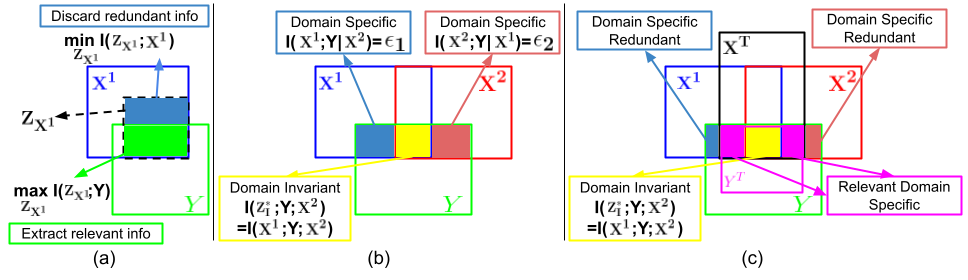
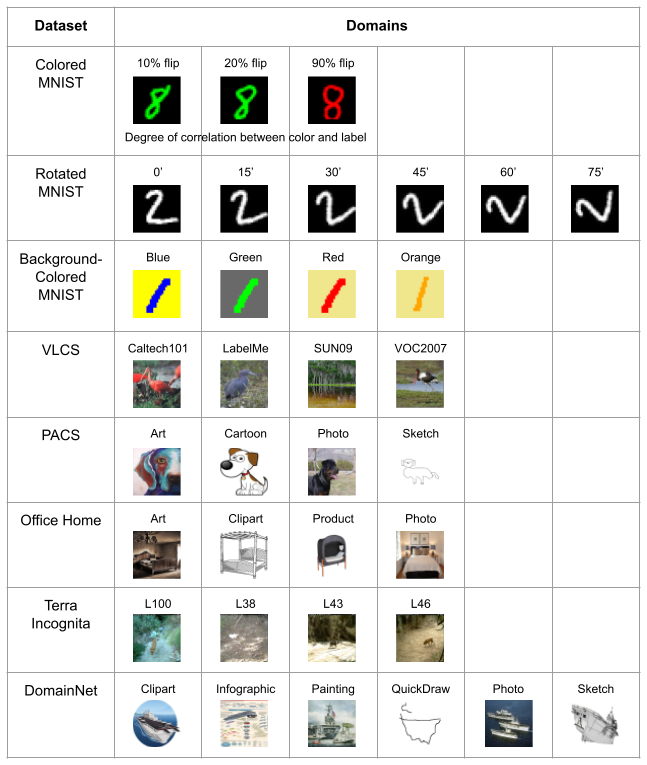
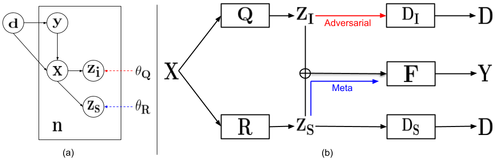
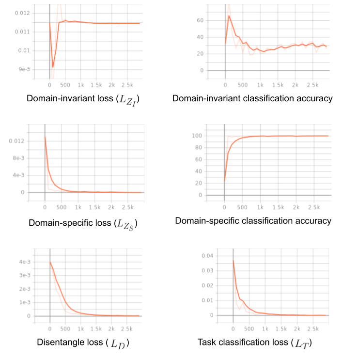
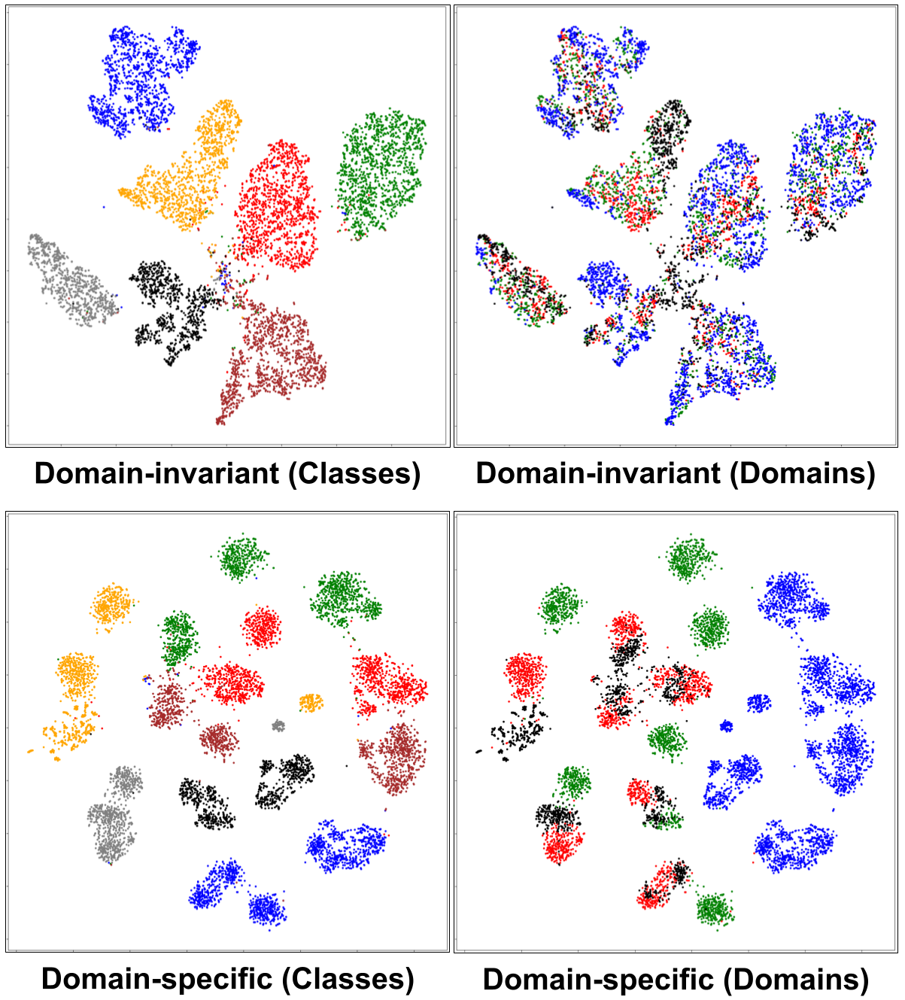
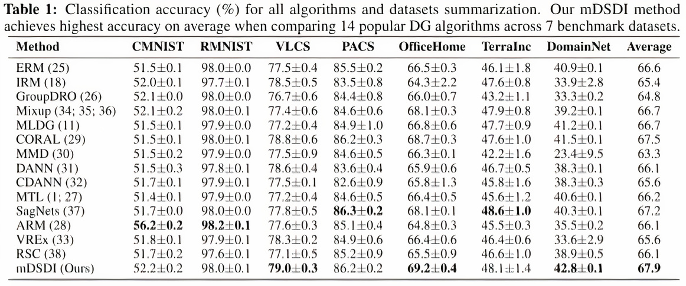

# Exploiting Domain-Specific Features to Enhance Domain Generalization

## Table of Content

1. [Introduction](#intro)
2. [Guideline](#guideline)
    - [To prepare](#prepare)
    - [To run experiments](#experiments)
    - [To visualize objective functions](#visualize)
    - [To plot feature representations](#plot)
    - [To run on `DomainBed, Ishaan and David, 2021` library](#DomainBed)

## <a name="intro"></a> Introduction

This repository contains the implementation of meta-Domain Specific-Domain Invariant (mDSDI), a theoretical sound framework based on the Information-Bottleneck principle to investigate foundational questions in Domain Generalization (DG). 
Following the theoretical analysis of the limitation when only learning domain-invariant and the essential of domain-specific representation,
mDSDI extends beyond the invariance view by adversarial training to further capture the usefulness of domain-specific information by meta-training. 
Its results show competitive performance with state-of-the-art techniques in DG and confirm the hypothesis that domain-specific is essential in ablation studies.



Details of the model and experimental results can be found in our following NeurIPS 2021 [paper](https://arxiv.org/abs/2110.09410):
```bibtex
@Inproceedings{bui2021exploiting,
      title={Exploiting Domain-Specific Features to Enhance Domain Generalization}, 
      author={Manh-Ha Bui and Toan Tran and Anh Tuan Tran and Dinh Phung},
      year={2021},
      booktitle={Proceedings of the Thirty-Fifth Annual Conference on Neural Information Processing Systems}
}
```
**Please CITE** our paper if you find it useful in your research.

## <a name="guideline"></a> Guideline
### <a name="prepare"></a> To prepare:
Install prerequisite packages:
```sh
python -m pip install -r requirements.txt
```

Download and unzip the datasets:
```sh
bash setup.sh
```



### <a name="experiments"></a> To run experiments:
Run with five different seeds:
```sh
for i in {1..3}; do
     taskset -c <cpu_index> python main.py --config <config_path> --exp_idx $i --gpu_idx <gpu_index>
done
```
where the parameters are the following:
- `<cpu_index>`: CPU index. E.g., `<cpu_index> = "1"`
- `<config_path>`: path stored configuration hyper-parameters. E.g., `<config_path> = "algorithms/mDSDI/configs/PACS_photo.json"`
- `<gpu_index>`: GPU index. E.g., `<gpu_index> = "0"`

**Note:** Select different settings by editing in `/configs/..json`, logging results are stored in `/results/logs/`



### <a name="visualize"></a> To visualize objective functions:

```sh
tensorboard --logdir <logdir>
```
where `<logdir>`: absolute path stored TensorBoard results. E.g., `<logdir> = "/home/ubuntu/mDSDI/algorithms/mDSDI/results/tensorboards/PACS_photo_1"`



### <a name="plot"></a> To plot feature representations:

```sh
python utils/tSNE_plot.py --plotdir <plotdir>
```
where `<plotdir>`: path stored results to plot. E.g., `<plotdir> = "algorithms/mDSDI/results/plots/PACS_photo_1/"`



**Note:** Results are stored in `/results/plots/`

### <a name="DomainBed"></a> To run on ["DomainBed, Ishaan and David, 2021"](https://github.com/facebookresearch/DomainBed) library:

```sh
cd DomainBed/
python -m domainbed.scripts.train --data_dir=../data/ --algorithm MDSDI --dataset <dataset_name> --test_env <env_idx>
```
where the parameters are the following:
- `<dataset_name>`: name of 5 benchmark datasets, including: RotatedMNIST | VLCS | OfficeHome | PACS | DomainNet. E.g., `<dataset_name> = PACS`
- `<test_env>`: index of the target domain. E.g., `<dataset_name> = 0`



**Note:** Results are stored in `DomainBed/results/train_output/out.txt`

## License

This source code is released under the Apache-2.0 license, included [here](LICENSE).
